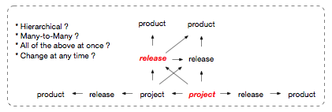
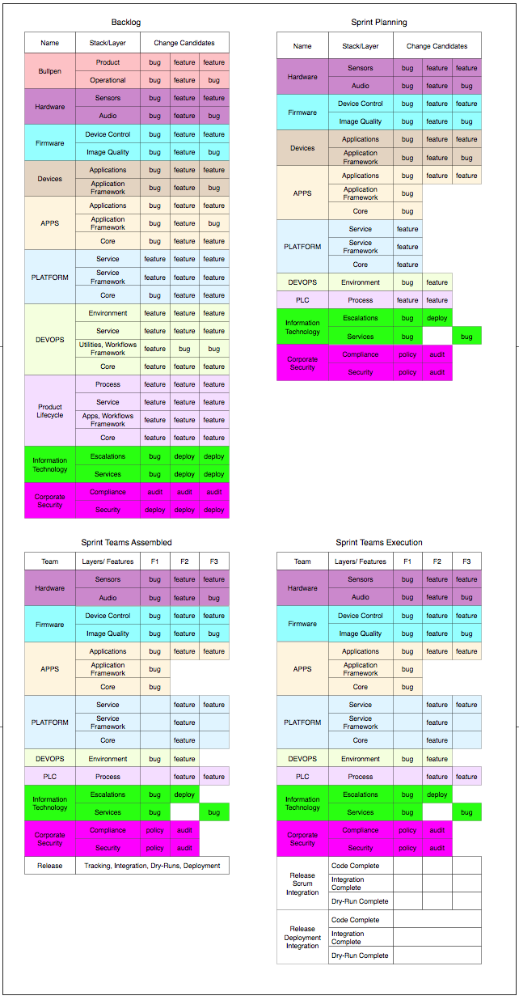

Workspaces and Time to Market
---
The Workspace, is the center of the developers the world

The developers are at the center of the Inner Loop

To have a great back-end (Outer Loop), start by creating a great front-end (Inner Loop)  

The Microsoft Bing team has written a very good [article](https://www.youtube.com/playlist?list=PLReL099Y5nRdbZoYZfTIwVEmrUTrWmbWx) on their Inner and Outer Loops

**Inner Loop**  *The loop that spans ideation through code commit, and most 
often centers on an engineer writing the code for a given feature. Because 
engineers require an idea from which to design and build a feature, this loop 
also includes prototyping, crowd-sourced feature engagement and feasibility 
studies.*  

**Outer Loop**: *This is the loop that gets committed code out to Production. 
Because a feature is not really finished until we have successfully navigated 
live user trials, our experimentation-centered culture requires that we 
consider the cost of flighting features within this loop.*  

Design and Implement for The Inner Loop Matrix
---
Working in a matrix organization, on a matrix of products and services.  Everything from 
planning, priorities, communications, product lifecycles, automation, architecture, code 
structure, everything is impacted by The Matrix.

### Obsess With Structure and Interfaces  
To fight complexity while working in the matrix, create structure and interfaces that can adapt to change

**Monolithic vs Granular Codebases**  

The elephant in the room... monolithic or granular codebases? Context is very important in this
type of discussion. Type of product roadmaps, projects, release cadence, upgrade and maintenance 
cadence, intellectual property, team distribution, etc...   

Either way...   

* Architecting products, and services and the end-to-end development lifecyle, is best done in unison  
* Developing these in isolation, or the later after the former, impacts company scalability and responsive to change  
* Introduces signficiant context swithing on the developer, the number #1 impact to productivity  

  

When working in a company that develops a suite of products and/or services, a project can be delivered
into multiple release vehicles. These releases can be on different timelines too, and divergance
can occur.

Consider the project highlighted in red font. There are a lot of possibilities to deliver the project
into a product/service release from a business perspective  

* Going to the right, it ships unbundled (on its own) as a product  
* Going to the left, it ships thru another project
* Going vertical, it ships thru a release
* Going diagional, it ships thru another release
* It could be going into any combination of these pipelines and at any given time
* It could be part of a SaaS deliverable, and also an On-Premise deliverable
* It could be a customer special, a marketing/convention special
* It could be a business model where a partner licenses, adds value, and sells to their customers

Complexity to internal stakeholder can be significant

* How to protect IP when working with 3rd party 
* Tracking requirements and bugs found by customers becomes difficult. Which product, which release  
* Bugs are cross-cutting among multiple projects, and releases
* Environments diverge, different base OS distro versions, toolchains, dependencies  
* Branching and build variants  
* Automation pipelines diverge  
* Compute resources are a constraint
* The wiki becomes difficult to navigate  

Throw devices into the mix, and now we have features and bugs that span the service and 
the device application, as well as the partner channel.  **Welcome to The Matrix**  

Design Inner Loop for Mutability
---
* Aim for 100% mutable Inner Loop and 100% immutable Outer Loop
* Mix-n-Match-Slice-n-Dice the Inner and Outer Loop to run within the Inner Loop
* Responsive and adaptable to rapid incremental change
* Results in greater developer productivity  
* Results in greater flexiblity for the developer to use their own judgement
* Aligned with working in a matrix, on a matrix of product and services  

The challenge is how to create a 100% mutable Inner Loop that is just as predictable
and manageable as an immutable Outer Loop. 

* Precision in change management
* Automation designed for relocatability, where everything can be overridden  
* Can freeze and reproduce at any moment in time (predictability)

**Relocatability**
* Can obtain inputs from anywhere that provides read access
* Can write inputs to anywhere that provides write access
* Can execute process anywhere that provides execute permissions  
* Tasks that run upstream can run downstream and vice versa  

**This sets the stage for distributed parallel process execution, speed and agility**  
* Simultaneously Setup, Integrate, Build, Test, Publish -- Anytime, Anyone, Anywhere
* Mix-n-Match-Slice-n-Dice  

Workspaces and End-to-End Gatekeeping in The Matrix  
---
[To Scale Up and Out... Scale Down](laptop-to-anywhere.png)

  

